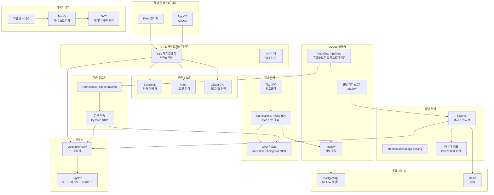
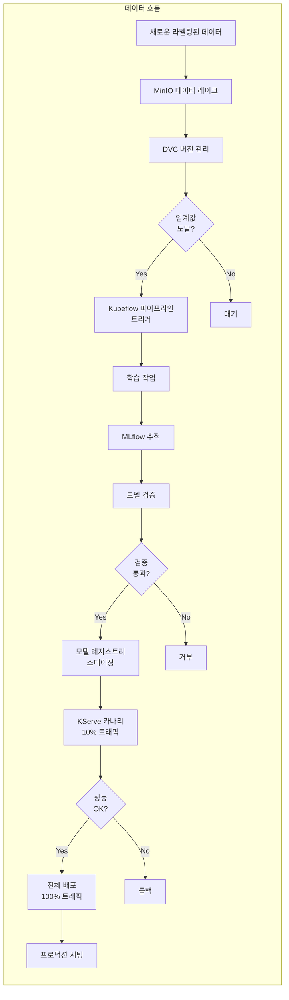
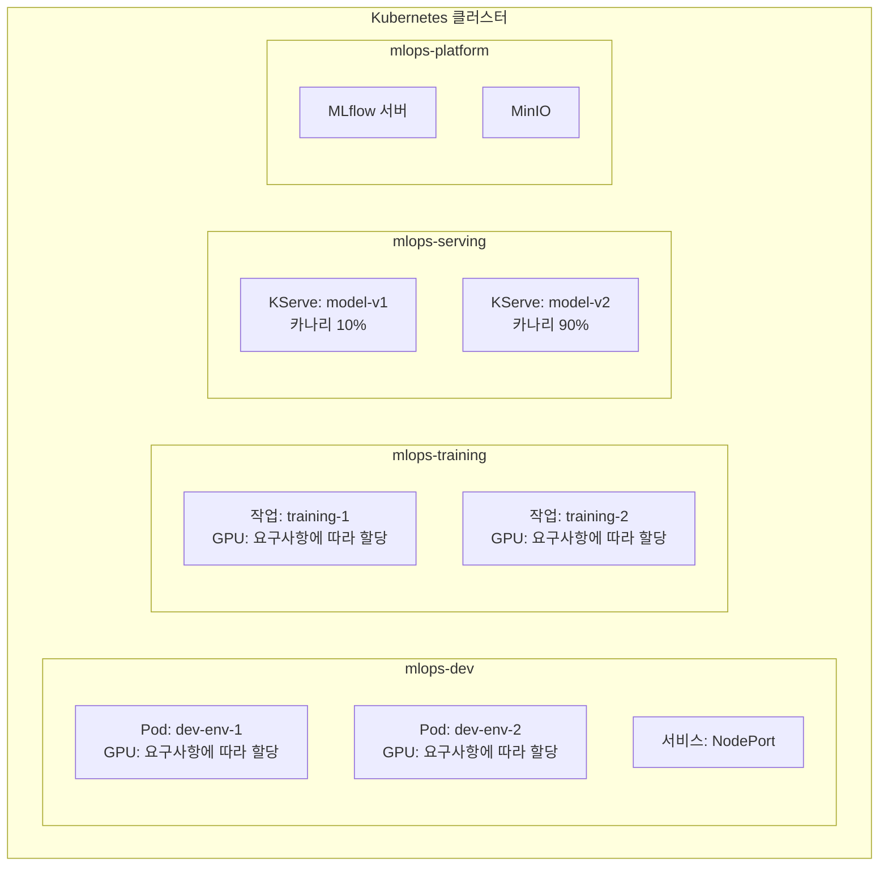
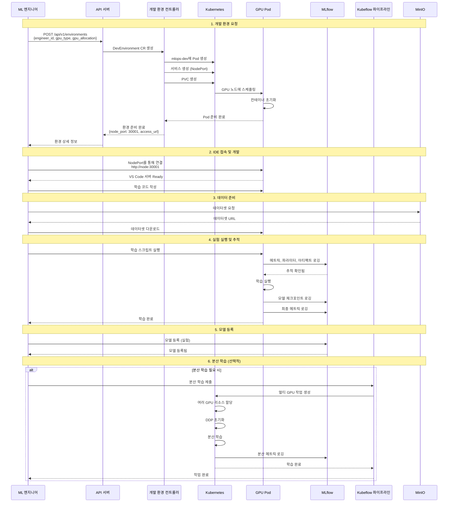
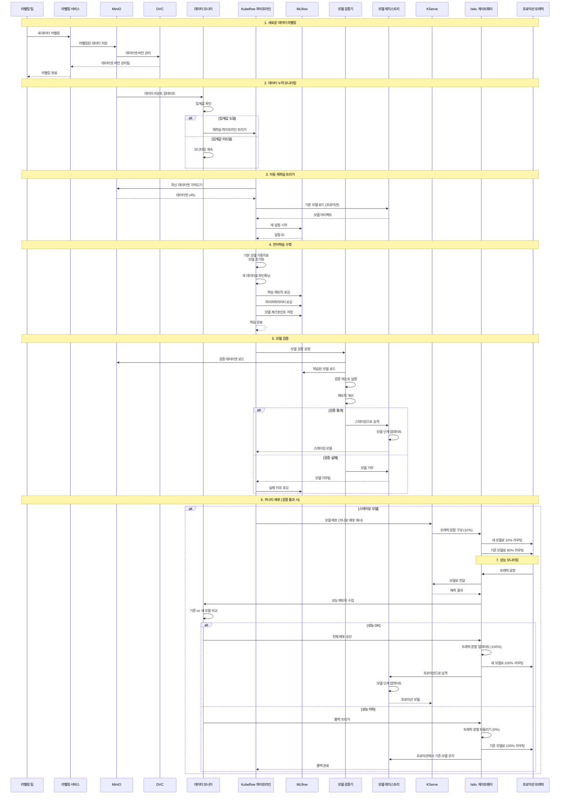
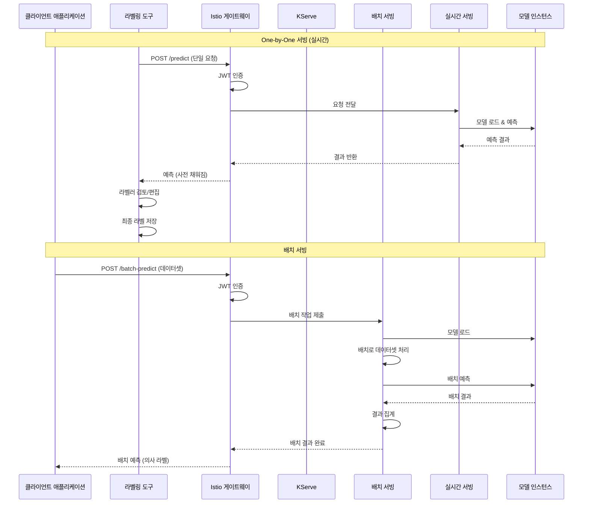

# MLOps Platform 설계 문서

## 목차

1. [개요](#개요)
2. [System Architecture](#system-architecture)
3. [Sequence Diagrams](#sequence-diagrams)
4. [인증 및 인가 시스템](#인증-및-인가-시스템)
5. [기술 스택 선정](#기술-스택-선정)
6. [예상 이슈 및 해결 방안](#예상-이슈-및-해결-방안)
7. [구현 계획](#구현-계획)

---

## 개요

### 프로젝트 목표

ML 엔지니어가 격리된 개발 환경에서 모델을 개발하고, 라벨링된 데이터로 지속적으로 모델을 개선하며, 안전하게 배포할 수 있는 MLOps 플랫폼을 설계합니다.

### 핵심 요구사항

1. **모델 개발 환경**: 격리된 GPU 개발 환경 제공
2. **모델 학습 파이프라인**: 자동화된 실험 추적 및 재학습
3. **모델 서빙**: Batch 및 Real-time 서빙 지원
4. **안전한 배포**: 무중단(Canary, Blue-Greend 등..) 배포를 통한 점진적 배포
5. **분산 학습**: 대용량 데이터셋 분산 학습 지원
6. **멀티클러스터**: Kubernetes 멀티 클러스터 관리
7. **제로 트러스트**: 네트워크 기반 신뢰 없이 모든 트래픽 검증

---

## System Architecture

### 전체 시스템 아키텍처

### 데이터 흐름

### 네임스페이스 구조

### 구성요소 상세 설명

#### 1. Development Environment Manager
- **역할**: ML 엔지니어의 격리된 GPU 개발 환경 할당 및 관리
- **기술**: Kubernetes Custom Controller (Operator Pattern)
- **격리 전략**: 
  - 네임스페이스: 목적별 분리 (dev, training, serving)
  - Pod 단위 격리: ML엔지니에에게는 필요에 따라 Pod 단위로 격리된 환경 제공
  - 유연한 GPU 할당: 요구사항에 따라 다양한 GPU 할당 방식 지원
- **GPU 할당 방식**:
  - **MIG (Multi-Instance GPU)**: A100/H100의 하드웨어 레벨 분할
  - **Time-Slicing**: 시간 분할 방식으로 여러 Pod이 GPU 공유
  - **전체 GPU 할당**: 하나의 Pod에 전체 GPU 할당
  - 기타: CUDA MPS 등 다양한 방식 지원
- **선택 이유**:
  - 확장성: 다수의 엔지니어 지원 가능
  - 리소스 효율: 네임스페이스 수 최소화로 관리 용이
  - 격리 보장: Pod 레벨에서 충분한 격리

#### 2. Istio Service Mesh & API Gateway
- **역할**: 서비스 메시, API Gateway, 제로 트러스트 네트워킹
- **주요 기능**:
  - mTLS: 모든 서비스 간 암호화 통신
  - AuthorizationPolicy: 세밀한 접근 제어
  - Gateway: Ingress/Egress 게이트웨이
  - VirtualService: 트래픽 라우팅
  - Envoy를 통한 메트릭/트레이스 생성 -> 모니터링 용이
- **선택 이유**:
  - 서비스 메시와 API Gateway 통합
  - 제로 트러스트 구현 용이
  - OpenTelemetry와 완벽 통합
  - 멀티클러스터 지원

#### 3. MLflow
- **역할**: 실험 추적, 메트릭/파라미터/아티팩트/모델 저장
- **선택 이유**:
  - 실험 추적과 모델 레지스트리 통합 제공
  - 다양한 ML 프레임워크 지원
  - REST API를 통한 쉬운 관리

#### 4. Kubeflow Pipelines
- **역할**: 모델 학습 파이프라인 오케스트레이션
- **선택 이유**:
  - Kubernetes 네이티브 워크플로우 오케스트레이션
  - 컴포넌트 기반으로 재사용 용이
  - 자동 재학습 트리거 및 스케줄링 지원
  - 파이프라인 버전 관리 및 재현성 보장

#### 5. KServe
- **역할**: 모델 서빙 (배치, 실시간 등..)
- **선택 이유**:
  - Kubernetes 네이티브 서빙 솔루션
  - Batch와 Real-time 서빙 모두 지원
  - 자동 스케일링 및 A/B 테스팅 지원
  - Istio와의 통합을 통한 Canary 배포

#### 6. OpenTelemetry + SigNoz
- **역할**: 통합 옵저버빌리티 (로그, 메트릭, 트레이스)
- **선택 이유**:
  - 하나의 표준으로 모든 옵저버빌리 데이터 수집
  - 로그/메트릭/트레이스 통합 관리
  - Istio와 통합 용이

#### 7. Cilium CNI
- **역할**: CNI 및 네트워크 레벨 정책 (L3/L4)
- **선택 이유**:
  - eBPF 기반 고성능 네트워킹
  - 네트워크 레벨 정책 (L3/L4)
  - 멀티클러스터 지원

**Istio와 Cilium의 역할 분리**:
- **Cilium**: CNI로 네트워크 레벨 정책 (L3/L4), 멀티클러스터 간 Pod 통신
- **Istio + Envoy**: 서비스 메시로 애플리케이션 레벨 정책 (L7), mTLS, 트래픽 관리
- **함께 사용**: Cilium이 네트워크 레벨에서 기본 보안 제공, Istio가 L7 레벨에서 세밀한 제어

#### 8. Keycloak + Vault (인증 및 인가)
- **역할**: Identity Provider 및 Secrets Management
- **선택 이유**:
  - 완전한 오픈소스
  - OIDC, OAuth2 지원
  - 중앙화된 시크릿 관리
  - Kubernetes 통합
  - 역할 기반 접근 제어 (RBAC) 지원

**상세 내용**: [인증 및 인가 시스템](./architecture/authentication-authorization.md) 문서 참고

---

## Sequence Diagrams

### 1. ML 엔지니어의 모델 개발 및 학습 흐름

### 2. 새로운 데이터 누적 → 재학습 → 배포까지의 흐름

### 3. 모델 서빙 흐름 (Batch 및 One-by-One)

---

## 인증 및 인가 시스템

여러 역할(관리자, ML 엔지니어, 데이터 엔지니어 등)을 관리하고, 각 역할에 따라 접근 권한을 제한하는 통합 인증/인가 시스템입니다.

### 주요 구성 요소

- **Keycloak**: Identity Provider, OIDC/OAuth2 기반 인증
- **Istio**: JWT 검증 및 역할 기반 접근 제어 (AuthorizationPolicy)
- **Kubernetes RBAC**: 리소스 레벨 접근 제어
- **Vault**: 시크릿 접근 제어

### 역할 정의

| 역할 | 주요 권한 |
|------|----------|
| **관리자** | 모든 리소스 접근, 사용자 관리 |
| **ML 엔지니어** | 개발 환경 생성, 실험 실행, 모델 등록 |
| **데이터 엔지니어** | 데이터 업로드, 데이터 버전 관리 |
| **MLOps 엔지니어** | 파이프라인 관리, 모델 배포 |
| **라벨러** | 라벨링 도구 접근 |
| **뷰어** | 읽기 전용 접근 |

### 인증 흐름

1. **사용자 로그인**: Keycloak을 통해 인증
2. **JWT 토큰 발급**: 역할 정보가 포함된 토큰 발급
3. **API 요청**: Istio Gateway에서 JWT 검증 및 역할 확인
4. **리소스 접근**: Kubernetes RBAC 및 Vault Policy로 최종 권한 검증

상세 내용은 [인증 및 인가 시스템](./architecture/authentication-authorization.md) 문서를 참고하세요.

---

## 기술 스택 선정

### 최종 기술 스택

| 카테고리                     | 기술 | 선택 이유 |
|--------------------------|------|----------|
| **멀티클러스터 관리**            | Fleet + ArgoCD | 클러스터 수준 관리 + GitOps 배포 |
| **서비스 메시 & API Gateway** | Istio (Envoy) | 서비스 메시와 API Gateway 통합, L7 제어, 제로 트러스트, 자동 모니터링 |
| **네트워크 보안**              | Cilium CNI | CNI 및 네트워크 레벨 정책 (L3/L4), eBPF 기반 고성능 |
| **Identity & Access**    | Keycloak + Vault | OIDC/OAuth2 지원, 중앙화된 시크릿 관리 |
| **옵저버빌리**                | OpenTelemetry + SigNoz | 통합 표준, 올인원 솔루션, 고성능 |
| **MLOps 플랫폼**            | MLflow + Kubeflow + KServe | 실험 추적, 파이프라인, 서빙 통합 |
| **데이터**                  | MinIO + PostgreSQL + Redis | S3 호환, 관계형 DB, 캐싱 |

**Cilium과 Istio의 역할 분리**:
- **Cilium**: CNI로 네트워크 레벨 정책 (L3/L4), Pod 간 기본 네트워크 격리
- **Istio (Envoy)**: 서비스 메시로 애플리케이션 레벨 정책 (L7), mTLS, 트래픽 관리
- **함께 사용**: 다층 방어 전략 - Cilium이 네트워크 레벨에서 기본 보안 제공, Istio가 L7에서 세밀한 제어

### 기술 스택 비교

#### 서비스 메시 & API Gateway

| 항목 | Istio | Kong | Traefik |
|------|-------|------|---------|
| **서비스 메시** | 상 | 미지원 | 미지원 |
| **API Gateway** | 상 | 상 | 상 |
| **제로 트러스트** | 상 | 중 | 하 |
| **모니터링 통합** | 상 | 중 | 하 |
| **멀티클러스터** | 상 | 중 | 하 |
| **선택** | 선택 | - | - |

**선택 이유**: Istio는 서비스 메시와 API Gateway를 통합 제공하며, OpenTelemetry와 완벽 통합되어 자동 모니터링이 가능합니다.

#### 옵저버빌리티

| 항목 | OpenTelemetry + SigNoz | Prometheus + Loki + Tempo + Grafana |
|------|------------------------|-------------------------------------|
| **통합성** | 상 | 중 |
| **표준화** | 상 | 중 |
| **성능** | 상 | 상 |
| **운영 복잡도** | 상 | 하 |
| **선택** | 선택 | - |

**선택 이유**: OpenTelemetry는 업계 표준이며, SigNoz는 로그/메트릭/트레이스를 하나의 플랫폼에서 통합 관리할 수 있습니다.

#### MLOps 플랫폼

| 항목 | MLflow | Kubeflow |
|------|--------|----------|
| **실험 추적** | 상 | 중 |
| **모델 레지스트리** | 상 | 중 |
| **파이프라인** | 하 | 상 |
| **오픈소스** | 지원 | 지원 |
| **선택** | 선택 (추적) | 선택 (파이프라인) |

**선택 이유**: MLflow는 실험 추적과 모델 레지스트리에 우수하며, Kubeflow는 Kubernetes 네이티브 파이프라인 오케스트레이션에 적합합니다.

---

## 예상 이슈 및 해결 방안

### 1. GPU 리소스 부족

**문제**:
- 여러 ML 엔지니어가 동시에 GPU를 요청할 때 리소스 부족 발생
- 학습 작업과 개발 환경이 GPU를 경쟁적으로 사용

**해결 방안**:
- **다양한 GPU 할당 방식 활용**: 
  - MIG (A100/H100): 하드웨어 레벨 분할로 하나의 GPU를 여러 인스턴스로 분할
  - Time-Slicing: 시간 분할 방식으로 여러 Pod이 GPU 공유
  - 전체 GPU 할당: 성능이 중요한 작업에 전체 GPU 할당
  - 요구사항에 따라 적절한 방식 선택
- **리소스 큐 시스템**: GPU 요청을 큐에 넣고 우선순위 기반으로 할당 (학습시 활용)
- **리소스 풀 분리**: 개발용 GPU 풀과 학습용 GPU 풀 분리
- **모니터링**: 할당하고 사용하지 않는 GPU 모니터링 (엔지니어에게 제공된 경우)

### 2. 모델 버전 관리 복잡성

**문제**:
- 모델 아티팩트가 크고 버전이 많아지면 저장소 용량 부족
- 모델과 코드 버전 간 불일치 발생

**해결 방안**:
- **모델 아티팩트 정책**: 
  - 오래된 모델 자동 아카이빙 (MinIO Lifecycle)
  - 실험 단계 모델은 일정 기간 후 자동 삭제
- **버전 태깅**: Git 태그와 모델 버전을 연결하여 추적
- **모델 메타데이터**: 모델 레지스트리에 코드 커밋 해시 저장

### 3. 자동 재학습 트리거 최적화

**문제**:
- 데이터 임계값 설정이 어려움 (너무 낮으면 빈번한 재학습, 너무 높으면 반영 지연)
- 재학습 중 리소스 경쟁

**해결 방안**:
- **스케줄링**: 재학습을 비피크 시간에 실행
- **점진적 학습**: 전체 재학습 대신 증분 학습 고려

### 4. Canary 배포 실패 시 롤백

**문제**:
- 새 모델 배포 후 성능 저하 감지 시 빠른 롤백 필요
- 롤백 과정에서 서비스 중단 가능성

**해결 방안**:
- **자동 롤백**: 
  - 실시간 메트릭 모니터링 (지연시간, 에러율 등)
  - 임계값 초과 시 자동 롤백 트리거
- **Istio 트래픽 분할**: 점진적 전환 (10% → 50% → 100%)
- **블루-그린 배포**: 롤백 시 즉시 전환 가능한 구조

### 6. 개발 환경 격리 및 보안

**문제**:
- 여러 엔지니어가 같은 클러스터를 사용할 때 보안 및 격리 우려
- 민감한 데이터 접근 제어

**해결 방안**:
- **Pod 레벨 격리**: 공통 네임스페이스에서 Pod 단위 격리
- **Istio AuthorizationPolicy**: 서비스 간 접근 제어
- **Cilium Network Policy**: 네트워크 레벨 격리
- **RBAC**: 역할 기반 접근 제어로 리소스 접근 제한
- **Vault**: Kubernetes Secrets 또는 Vault를 통한 민감 정보 관리
- **이미지 스캔**: 컨테이너 이미지 보안 취약점 스캔

### 7. 비용 관리

**문제**:
- GPU 리소스 사용으로 인한 높은 비용
- 사용하지 않는 리소스에 대한 비용 발생

**해결 방안**:
- **리소스 모니터링**: SigNoz를 통한 사용량 추적 및 비용 분석 대시보드
- **자동 스케일 다운**: 사용하지 않는 개발 환경 자동 종료 (TTL 기반)
- **유연한 GPU 할당**: 
  - MIG, Time-Slicing 등으로 GPU 활용률 향상
  - 작업 특성에 맞는 할당 방식 선택
- **리소스 할당량**: 엔지니어별 GPU 사용 시간 제한
- **비용 알림**: 예산 초과 시 자동 알림

### 8. 멀티클러스터 관리 복잡성

**문제**:
- 여러 클러스터 간 일관성 유지 어려움
- 클러스터 간 통신 및 보안 관리

**해결 방안**:
- **Fleet + ArgoCD**: 중앙화된 클러스터 및 애플리케이션 관리
- **Istio Multi-Primary**: 클러스터 간 서비스 메시 통합
- **정책 자동화**: GitOps를 통한 정책 자동 배포
- **모니터링 통합**: SigNoz를 통한 멀티클러스터 옵저버빌리

### 9. 옵저버빌리 데이터 과부하

**문제**:
- 대량의 로그, 메트릭, 트레이스 데이터로 인한 저장소 부담
- 쿼리 성능 저하

**해결 방안**:
- **샘플링**: 트레이스 샘플링으로 데이터 양 감소
- **데이터 보존 정책**: 오래된 데이터 자동 아카이빙
- **ClickHouse 최적화**: SigNoz의 ClickHouse 기반 고성능 쿼리
- **인덱싱**: 자주 조회하는 데이터 인덱싱
