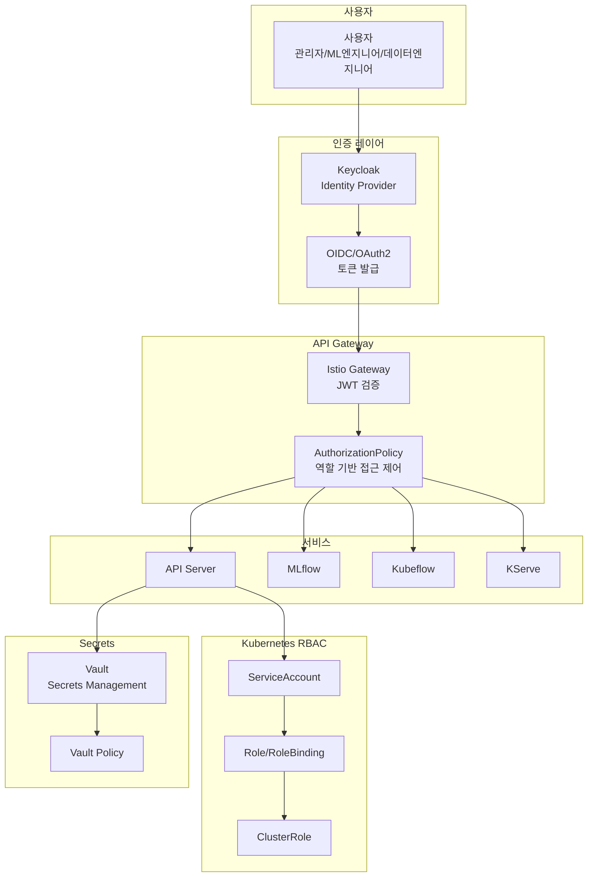
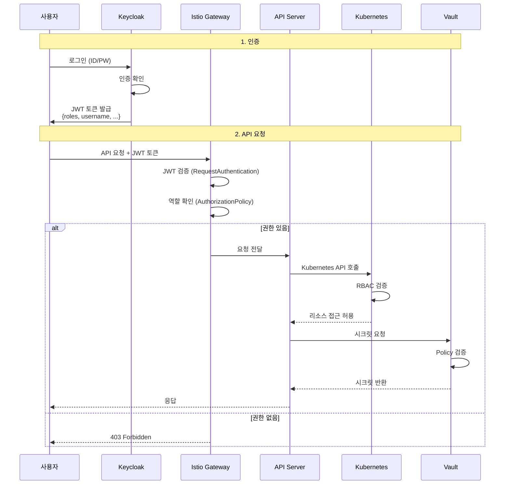

# MLOps Platform 설계 문서

## 목차

1. [개요](#개요)
2. [System Architecture](#system-architecture)
3. [Sequence Diagrams](#sequence-diagrams)
4. [인증 및 인가 시스템](#인증-및-인가-시스템)
5. [기술 스택 선정](#기술-스택-선정)
6. [예상 이슈 및 해결 방안](#예상-이슈-및-해결-방안)
7. [구현 계획](#구현-계획)

---

## 개요

### 프로젝트 목표

ML 엔지니어가 격리된 개발 환경에서 모델을 개발하고, 라벨링된 데이터로 지속적으로 모델을 개선하며, 안전하게 배포할 수 있는 MLOps 플랫폼을 설계합니다.

### 핵심 요구사항

1. **모델 개발 환경**: 격리된 GPU 개발 환경 제공
2. **모델 학습 파이프라인**: 자동화된 실험 추적 및 재학습
3. **모델 서빙**: Batch 및 Real-time 서빙 지원
4. **안전한 배포**: 무중단(Canary, Blue-Greend 등..) 배포를 통한 점진적 배포
5. **분산 학습**: 대용량 데이터셋 분산 학습 지원
6. **멀티클러스터**: Kubernetes 멀티 클러스터 관리
7. **제로 트러스트**: 네트워크 기반 신뢰 없이 모든 트래픽 검증

---

## System Architecture

### 전체 시스템 아키텍처


### 데이터 흐름


### 네임스페이스 구조


### 구성요소 상세 설명

#### 1. Development Environment Manager
- **역할**: ML 엔지니어의 격리된 GPU 개발 환경 할당 및 관리
- **기술**: Kubernetes Custom Controller (Operator Pattern)
- **격리 전략**: 
  - 네임스페이스: 목적별 분리 (dev, training, serving)
  - Pod 단위 격리: ML엔지니에에게는 필요에 따라 Pod 단위로 격리된 환경 제공
  - 유연한 GPU 할당: 요구사항에 따라 다양한 GPU 할당 방식 지원
- **GPU 할당 방식**:
  - **MIG (Multi-Instance GPU)**: A100/H100의 하드웨어 레벨 분할
  - **Time-Slicing**: 시간 분할 방식으로 여러 Pod이 GPU 공유
  - **전체 GPU 할당**: 하나의 Pod에 전체 GPU 할당
  - 기타: CUDA MPS 등 다양한 방식 지원
- **선택 이유**:
  - 확장성: 다수의 엔지니어 지원 가능
  - 리소스 효율: 네임스페이스 수 최소화로 관리 용이
  - 격리 보장: Pod 레벨에서 충분한 격리

#### 2. Istio Service Mesh & API Gateway
- **역할**: 서비스 메시, API Gateway, 제로 트러스트 네트워킹
- **주요 기능**:
  - mTLS: 모든 서비스 간 암호화 통신
  - AuthorizationPolicy: 세밀한 접근 제어
  - Gateway: Ingress/Egress 게이트웨이
  - VirtualService: 트래픽 라우팅
  - Envoy를 통한 메트릭/트레이스 생성 -> 모니터링 용이
- **선택 이유**:
  - 서비스 메시와 API Gateway 통합
  - 제로 트러스트 구현 용이
  - OpenTelemetry와 완벽 통합
  - 멀티클러스터 지원

#### 3. MLflow
- **역할**: 실험 추적, 메트릭/파라미터/아티팩트/모델 저장
- **선택 이유**:
  - 실험 추적과 모델 레지스트리 통합 제공
  - 다양한 ML 프레임워크 지원
  - REST API를 통한 쉬운 관리

#### 4. Kubeflow Pipelines
- **역할**: 모델 학습 파이프라인 오케스트레이션
- **선택 이유**:
  - Kubernetes 네이티브 워크플로우 오케스트레이션
  - 컴포넌트 기반으로 재사용 용이
  - 자동 재학습 트리거 및 스케줄링 지원
  - 파이프라인 버전 관리 및 재현성 보장

#### 5. KServe
- **역할**: 모델 서빙 (배치, 실시간 등..)
- **선택 이유**:
  - Kubernetes 네이티브 서빙 솔루션
  - Batch와 Real-time 서빙 모두 지원
  - 자동 스케일링 및 A/B 테스팅 지원
  - Istio와의 통합을 통한 Canary 배포

#### 6. OpenTelemetry + SigNoz
- **역할**: 통합 옵저버빌리티 (로그, 메트릭, 트레이스)
- **선택 이유**:
  - 하나의 표준으로 모든 관찰 가능성 데이터 수집
  - 로그/메트릭/트레이스 통합 관리
  - Istio와 통합 용이

#### 7. Cilium CNI
- **역할**: CNI 및 네트워크 레벨 정책 (L3/L4)
- **선택 이유**:
  - eBPF 기반 고성능 네트워킹
  - 네트워크 레벨 정책 (L3/L4)
  - 멀티클러스터 지원

**Istio와 Cilium의 역할 분리**:
- **Cilium**: CNI로 네트워크 레벨 정책 (L3/L4), 멀티클러스터 간 Pod 통신
- **Istio + Envoy**: 서비스 메시로 애플리케이션 레벨 정책 (L7), mTLS, 트래픽 관리
- **함께 사용**: Cilium이 네트워크 레벨에서 기본 보안 제공, Istio가 L7 레벨에서 세밀한 제어

#### 8. Keycloak + Vault (인증 및 인가)
- **역할**: Identity Provider 및 Secrets Management
- **선택 이유**:
  - 완전한 오픈소스
  - OIDC, OAuth2 지원
  - 중앙화된 시크릿 관리
  - Kubernetes 통합
  - 역할 기반 접근 제어 (RBAC) 지원

**상세 내용은 [인증 및 인가 시스템](#인증-및-인가-시스템) 섹션 참고**

---

## Sequence Diagrams

### 1. ML 엔지니어의 모델 개발 및 학습 흐름


### 2. 새로운 데이터 누적 → 재학습 → 배포까지의 흐름


### 3. 모델 서빙 흐름 (Batch 및 One-by-One)


---

## 인증 및 인가 시스템

### 개요

여러 역할(관리자, ML 엔지니어, 데이터 엔지니어 등)을 관리하고, 각 역할에 따라 접근 권한을 제한하는 통합 인증/인가 시스템입니다.

### 역할 정의

| 역할 | 설명 | 주요 권한 |
|------|------|----------|
| **관리자 (Admin)** | 플랫폼 전체 관리 | 모든 리소스 접근, 사용자 관리, 정책 설정 |
| **ML 엔지니어 (ML Engineer)** | 모델 개발 및 학습 | 개발 환경 생성, 실험 실행, 모델 등록 |
| **데이터 엔지니어 (Data Engineer)** | 데이터 관리 | 데이터 업로드, 데이터 버전 관리, 데이터 품질 관리 |
| **MLOps 엔지니어 (MLOps Engineer)** | 파이프라인 및 배포 관리 | 파이프라인 관리, 모델 배포, 모니터링 |
| **라벨러 (Labeler)** | 데이터 라벨링 | 라벨링 도구 접근, 데이터 라벨링 |
| **뷰어 (Viewer)** | 읽기 전용 접근 | 실험 결과 조회, 모델 정보 조회 |

### 인증/인가 아키텍처



### 권한 매트릭스

| 리소스/액션 | 관리자 | ML 엔지니어 | 데이터 엔지니어 | MLOps 엔지니어 | 라벨러 | 뷰어 |
|------------|--------|------------|---------------|---------------|--------|------|
| **개발 환경** |
| 생성/삭제 | ✅ | ✅ | ❌ | ✅ | ❌ | ❌ |
| 조회 | ✅ | ✅ (본인) | ❌ | ✅ | ❌ | ❌ |
| **실험 관리** |
| 실험 실행 | ✅ | ✅ | ❌ | ✅ | ❌ | ❌ |
| 실험 조회 | ✅ | ✅ (본인) | ❌ | ✅ | ❌ | ✅ |
| 실험 삭제 | ✅ | ✅ (본인) | ❌ | ✅ | ❌ | ❌ |
| **모델 레지스트리** |
| 모델 등록 | ✅ | ✅ | ❌ | ✅ | ❌ | ❌ |
| 모델 승인 | ✅ | ❌ | ❌ | ✅ | ❌ | ❌ |
| 모델 조회 | ✅ | ✅ | ❌ | ✅ | ❌ | ✅ |
| **파이프라인** |
| 파이프라인 생성 | ✅ | ❌ | ❌ | ✅ | ❌ | ❌ |
| 파이프라인 실행 | ✅ | ❌ | ❌ | ✅ | ❌ | ❌ |
| 파이프라인 조회 | ✅ | ❌ | ❌ | ✅ | ❌ | ✅ |
| **모델 배포** |
| 배포 | ✅ | ❌ | ❌ | ✅ | ❌ | ❌ |
| 롤백 | ✅ | ❌ | ❌ | ✅ | ❌ | ❌ |
| 조회 | ✅ | ❌ | ❌ | ✅ | ❌ | ✅ |
| **데이터 관리** |
| 데이터 업로드 | ✅ | ❌ | ✅ | ❌ | ❌ | ❌ |
| 데이터 버전 관리 | ✅ | ❌ | ✅ | ❌ | ❌ | ❌ |
| 데이터 조회 | ✅ | ✅ | ✅ | ✅ | ✅ | ✅ |
| **라벨링** |
| 라벨링 | ✅ | ❌ | ❌ | ❌ | ✅ | ❌ |
| 라벨링 조회 | ✅ | ✅ | ✅ | ✅ | ✅ | ✅ |
| **사용자 관리** |
| 사용자 생성/삭제 | ✅ | ❌ | ❌ | ❌ | ❌ | ❌ |
| 역할 할당 | ✅ | ❌ | ❌ | ❌ | ❌ | ❌ |
| **시크릿 접근** |
| 시크릿 읽기 | ✅ | ✅ (제한적) | ✅ (제한적) | ✅ (제한적) | ❌ | ❌ |
| 시크릿 쓰기 | ✅ | ❌ | ❌ | ❌ | ❌ | ❌ |

### Keycloak 구성

#### Realm 및 클라이언트 설정

```yaml
# Keycloak Realm 설정
realm: mlops-platform
clients:
  - clientId: mlops-api
    protocol: openid-connect
    publicClient: false
    standardFlowEnabled: true
    serviceAccountsEnabled: true
    authorizationServicesEnabled: true
    redirectUris:
      - "https://api.mlops.example.com/*"
    roles:
      - name: admin
      - name: ml-engineer
      - name: data-engineer
      - name: mlops-engineer
      - name: labeler
      - name: viewer
```

#### 역할 매핑

```yaml
# 사용자 역할 할당 예시
users:
  - username: admin-user
    roles:
      - admin
  - username: ml-engineer-1
    roles:
      - ml-engineer
  - username: data-engineer-1
    roles:
      - data-engineer
```

### Istio 인증 및 인가

#### JWT 인증 설정

```yaml
# RequestAuthentication - JWT 검증
apiVersion: security.istio.io/v1beta1
kind: RequestAuthentication
metadata:
  name: jwt-auth
  namespace: mlops-platform
spec:
  selector:
    matchLabels:
      app: mlops-api
  jwtRules:
  - issuer: "https://keycloak.example.com/realms/mlops-platform"
    jwksUri: "https://keycloak.example.com/realms/mlops-platform/protocol/openid-connect/certs"
    forwardOriginalToken: true
```

#### 역할 기반 접근 제어

```yaml
# AuthorizationPolicy - ML 엔지니어 권한
apiVersion: security.istio.io/v1beta1
kind: AuthorizationPolicy
metadata:
  name: ml-engineer-policy
  namespace: mlops-dev
spec:
  selector:
    matchLabels:
      app: dev-environment
  action: ALLOW
  rules:
  # ML 엔지니어는 본인의 개발 환경만 접근
  - from:
    - source:
        requestPrincipals: ["*"]
    when:
    - key: request.auth.claims[groups]
      values: ["ml-engineer"]
    - key: request.auth.claims[preferred_username]
      values: ["${USERNAME}"]  # 본인만 접근
---
# AuthorizationPolicy - 데이터 엔지니어 권한
apiVersion: security.istio.io/v1beta1
kind: AuthorizationPolicy
metadata:
  name: data-engineer-policy
  namespace: mlops-platform
spec:
  selector:
    matchLabels:
      app: minio
  action: ALLOW
  rules:
  - from:
    - source:
        requestPrincipals: ["*"]
    when:
    - key: request.auth.claims[groups]
      values: ["data-engineer", "admin"]
    to:
    - operation:
        methods: ["GET", "PUT", "POST"]
        paths: ["/data/*"]
---
# AuthorizationPolicy - 관리자 권한
apiVersion: security.istio.io/v1beta1
kind: AuthorizationPolicy
metadata:
  name: admin-policy
  namespace: mlops-platform
spec:
  selector:
    matchLabels:
      app: mlops-api
  action: ALLOW
  rules:
  - from:
    - source:
        requestPrincipals: ["*"]
    when:
    - key: request.auth.claims[groups]
      values: ["admin"]
    to:
    - operation:
        methods: ["*"]
        paths: ["*"]
```

### Kubernetes RBAC 통합

#### ServiceAccount 및 Role 생성

```yaml
# ML 엔지니어용 ServiceAccount
apiVersion: v1
kind: ServiceAccount
metadata:
  name: ml-engineer-sa
  namespace: mlops-dev
  annotations:
    keycloak.org/realm: mlops-platform
    keycloak.org/role: ml-engineer
---
# ML 엔지니어용 Role
apiVersion: rbac.authorization.k8s.io/v1
kind: Role
metadata:
  name: ml-engineer-role
  namespace: mlops-dev
rules:
# 본인의 Pod만 관리
- apiGroups: [""]
  resources: ["pods", "services", "pvc"]
  resourceNames: ["dev-env-*"]  # 본인 이름 패턴
  verbs: ["get", "list", "watch", "create", "update", "patch", "delete"]
- apiGroups: [""]
  resources: ["pods/exec", "pods/log"]
  resourceNames: ["dev-env-*"]
  verbs: ["create"]
---
# RoleBinding
apiVersion: rbac.authorization.k8s.io/v1
kind: RoleBinding
metadata:
  name: ml-engineer-rolebinding
  namespace: mlops-dev
subjects:
- kind: ServiceAccount
  name: ml-engineer-sa
  namespace: mlops-dev
roleRef:
  kind: Role
  name: ml-engineer-role
  apiGroup: rbac.authorization.k8s.io
---
# 데이터 엔지니어용 Role
apiVersion: rbac.authorization.k8s.io/v1
kind: Role
metadata:
  name: data-engineer-role
  namespace: mlops-platform
rules:
- apiGroups: [""]
  resources: ["pods", "jobs"]
  verbs: ["get", "list", "watch"]
- apiGroups: [""]
  resources: ["pvc"]
  verbs: ["get", "list", "watch", "create"]
---
# MLOps 엔지니어용 ClusterRole
apiVersion: rbac.authorization.k8s.io/v1
kind: ClusterRole
metadata:
  name: mlops-engineer-clusterrole
rules:
- apiGroups: [""]
  resources: ["pods", "services", "jobs"]
  verbs: ["get", "list", "watch", "create", "update", "patch", "delete"]
- apiGroups: ["apps"]
  resources: ["deployments"]
  verbs: ["get", "list", "watch", "create", "update", "patch", "delete"]
- apiGroups: ["serving.kserve.io"]
  resources: ["inferenceservices"]
  verbs: ["get", "list", "watch", "create", "update", "patch", "delete"]
- apiGroups: ["kubeflow.org"]
  resources: ["pipelines", "pipelineruns"]
  verbs: ["get", "list", "watch", "create", "update", "patch", "delete"]
```

### Vault 정책 통합

#### Vault Policy 정의

```hcl
# 관리자 정책
path "secret/*" {
  capabilities = ["create", "read", "update", "delete", "list"]
}

# ML 엔지니어 정책
path "secret/data/mlflow/*" {
  capabilities = ["read"]
}

path "secret/data/dev-env/*" {
  capabilities = ["read", "update"]
}

# 데이터 엔지니어 정책
path "secret/data/minio/*" {
  capabilities = ["read"]
}

path "secret/data/datasets/*" {
  capabilities = ["read", "create", "update"]
}

# MLOps 엔지니어 정책
path "secret/data/mlflow/*" {
  capabilities = ["read", "update"]
}

path "secret/data/kserve/*" {
  capabilities = ["read", "create", "update"]
}
```

#### Vault Kubernetes 인증

```yaml
# Vault Kubernetes Auth 설정
apiVersion: v1
kind: ServiceAccount
metadata:
  name: vault-auth
  namespace: mlops-platform
---
# Vault에서 Kubernetes 역할 생성
# vault write auth/kubernetes/role/ml-engineer \
#   bound_service_account_names=ml-engineer-sa \
#   bound_service_account_namespaces=mlops-dev \
#   policies=ml-engineer-policy \
#   ttl=1h
```

### API 서버 인증/인가 구현

#### JWT 토큰 검증

```python
# API 서버에서 JWT 검증 예시
from fastapi import Depends, HTTPException, status
from fastapi.security import HTTPBearer, HTTPAuthorizationCredentials
import jwt
from jwt import PyJWKClient

security = HTTPBearer()

def verify_token(credentials: HTTPAuthorizationCredentials = Depends(security)):
    """JWT 토큰 검증"""
    token = credentials.credentials
    
    # Keycloak에서 공개키 가져오기
    jwks_client = PyJWKClient("https://keycloak.example.com/realms/mlops-platform/protocol/openid-connect/certs")
    signing_key = jwks_client.get_signing_key_from_jwt(token)
    
    try:
        payload = jwt.decode(
            token,
            signing_key.key,
            algorithms=["RS256"],
            audience="mlops-api",
            issuer="https://keycloak.example.com/realms/mlops-platform"
        )
        return payload
    except jwt.ExpiredSignatureError:
        raise HTTPException(status_code=401, detail="Token expired")
    except jwt.InvalidTokenError:
        raise HTTPException(status_code=401, detail="Invalid token")

def require_role(required_role: str):
    """특정 역할 요구 데코레이터"""
    def role_checker(payload: dict = Depends(verify_token)):
        roles = payload.get("realm_access", {}).get("roles", [])
        if required_role not in roles and "admin" not in roles:
            raise HTTPException(
                status_code=403,
                detail=f"Requires role: {required_role}"
            )
        return payload
    return role_checker

# 사용 예시
@app.post("/api/v1/environments")
async def create_environment(
    request: CreateEnvironmentRequest,
    user: dict = Depends(require_role("ml-engineer"))
):
    # ML 엔지니어만 개발 환경 생성 가능
    username = user.get("preferred_username")
    # 환경 생성 로직
    ...
```

### 통합 인증 흐름



### 구현 계획

#### Phase 1: Keycloak 설정
1. Keycloak 설치 및 구성
2. Realm 및 클라이언트 생성
3. 역할 정의 및 사용자 할당

#### Phase 2: Istio 통합
1. RequestAuthentication 설정
2. AuthorizationPolicy 정의
3. JWT 검증 테스트

#### Phase 3: Kubernetes RBAC
1. ServiceAccount 생성
2. Role/RoleBinding 정의
3. ClusterRole 정의 (필요 시)

#### Phase 4: Vault 통합
1. Vault Policy 정의
2. Kubernetes 인증 설정
3. 시크릿 접근 테스트

#### Phase 5: API 서버 통합
1. JWT 검증 미들웨어 구현
2. 역할 기반 엔드포인트 보호
3. 통합 테스트

---

## 기술 스택 선정

### 최종 기술 스택

| 카테고리 | 기술 | 선택 이유 |
|---------|------|----------|
| **멀티클러스터 관리** | Fleet + ArgoCD | 클러스터 수준 관리 + GitOps 배포 |
| **서비스 메시 & API Gateway** | Istio (Envoy) | 서비스 메시와 API Gateway 통합, L7 제어, 제로 트러스트, 자동 모니터링 |
| **네트워크 보안** | Cilium CNI | CNI 및 네트워크 레벨 정책 (L3/L4), eBPF 기반 고성능 |
| **Identity & Access** | Keycloak + Vault | OIDC/OAuth2 지원, 중앙화된 시크릿 관리 |
| **관찰 가능성** | OpenTelemetry + SigNoz | 통합 표준, 올인원 솔루션, 고성능 |
| **MLOps 플랫폼** | MLflow + Kubeflow + KServe | 실험 추적, 파이프라인, 서빙 통합 |
| **데이터** | MinIO + PostgreSQL + Redis | S3 호환, 관계형 DB, 캐싱 |

**Cilium과 Istio의 역할 분리**:
- **Cilium**: CNI로 네트워크 레벨 정책 (L3/L4), Pod 간 기본 네트워크 격리
- **Istio (Envoy)**: 서비스 메시로 애플리케이션 레벨 정책 (L7), mTLS, 트래픽 관리
- **함께 사용**: 다층 방어 전략 - Cilium이 네트워크 레벨에서 기본 보안 제공, Istio가 L7에서 세밀한 제어

### 기술 스택 비교

#### 서비스 메시 & API Gateway

| 항목 | Istio | Kong | Traefik |
|------|-------|------|---------|
| **서비스 메시** | ⭐⭐⭐⭐⭐ | ❌ | ❌ |
| **API Gateway** | ⭐⭐⭐⭐⭐ | ⭐⭐⭐⭐⭐ | ⭐⭐⭐⭐ |
| **제로 트러스트** | ⭐⭐⭐⭐⭐ | ⭐⭐⭐ | ⭐⭐ |
| **모니터링 통합** | ⭐⭐⭐⭐⭐ | ⭐⭐⭐ | ⭐⭐ |
| **멀티클러스터** | ⭐⭐⭐⭐⭐ | ⭐⭐⭐ | ⭐⭐ |
| **선택** | ✅ | ❌ | ❌ |

**선택 이유**: Istio는 서비스 메시와 API Gateway를 통합 제공하며, OpenTelemetry와 완벽 통합되어 자동 모니터링이 가능합니다.

#### 관찰 가능성

| 항목 | OpenTelemetry + SigNoz | Prometheus + Loki + Tempo + Grafana |
|------|------------------------|-------------------------------------|
| **통합성** | ⭐⭐⭐⭐⭐ | ⭐⭐⭐ |
| **표준화** | ⭐⭐⭐⭐⭐ | ⭐⭐⭐ |
| **성능** | ⭐⭐⭐⭐⭐ | ⭐⭐⭐⭐ |
| **운영 복잡도** | ⭐⭐⭐⭐ | ⭐⭐ |
| **선택** | ✅ | ❌ |

**선택 이유**: OpenTelemetry는 업계 표준이며, SigNoz는 로그/메트릭/트레이스를 하나의 플랫폼에서 통합 관리할 수 있습니다.

#### MLOps 플랫폼

| 항목 | MLflow | Kubeflow | Weights & Biases |
|------|--------|----------|------------------|
| **실험 추적** | ⭐⭐⭐⭐⭐ | ⭐⭐⭐ | ⭐⭐⭐⭐⭐ |
| **모델 레지스트리** | ⭐⭐⭐⭐⭐ | ⭐⭐⭐ | ⭐⭐⭐ |
| **파이프라인** | ⭐⭐ | ⭐⭐⭐⭐⭐ | ⭐⭐ |
| **오픈소스** | ✅ | ✅ | ❌ |
| **선택** | ✅ (추적) | ✅ (파이프라인) | ❌ |

**선택 이유**: MLflow는 실험 추적과 모델 레지스트리에 우수하며, Kubeflow는 Kubernetes 네이티브 파이프라인 오케스트레이션에 적합합니다.

---

## 예상 이슈 및 해결 방안

### 1. GPU 리소스 부족

**문제**:
- 여러 ML 엔지니어가 동시에 GPU를 요청할 때 리소스 부족 발생
- 학습 작업과 개발 환경이 GPU를 경쟁적으로 사용

**해결 방안**:
- **다양한 GPU 할당 방식 활용**: 
  - MIG (A100/H100): 하드웨어 레벨 분할로 하나의 GPU를 여러 인스턴스로 분할
  - Time-Slicing: 시간 분할 방식으로 여러 Pod이 GPU 공유
  - 전체 GPU 할당: 성능이 중요한 작업에 전체 GPU 할당
  - 요구사항에 따라 적절한 방식 선택
- **리소스 큐 시스템**: GPU 요청을 큐에 넣고 우선순위 기반으로 할당
- **스케줄링 정책**: 
  - 개발 환경: 시간 제한 (예: 8시간 후 자동 종료)
  - 학습 작업: 우선순위 큐 (프로덕션 재학습 > 실험)
- **리소스 풀 분리**: 개발용 GPU 풀과 학습용 GPU 풀 분리

### 2. 모델 버전 관리 복잡성

**문제**:
- 모델 아티팩트가 크고 버전이 많아지면 저장소 용량 부족
- 모델과 코드 버전 간 불일치 발생

**해결 방안**:
- **모델 아티팩트 정책**: 
  - 오래된 모델 자동 아카이빙 (MinIO Lifecycle Policy)
  - 실험 단계 모델은 일정 기간 후 자동 삭제
- **버전 태깅**: Git 태그와 모델 버전을 연결하여 추적
- **모델 메타데이터**: 모델 레지스트리에 코드 커밋 해시 저장

### 3. 분산 학습 통신 오버헤드

**문제**:
- 여러 GPU 간 통신으로 인한 병목 현상
- 네트워크 대역폭 부족

**해결 방안**:
- **고속 네트워크**: InfiniBand 또는 고속 이더넷 사용
- **통신 최적화**: 
  - Gradient 압축 (Gradient Compression)
  - AllReduce 최적화 알고리즘 사용
- **로컬성 고려**: 같은 노드의 GPU를 우선적으로 할당
- **비동기 업데이트**: 완전 동기화 대신 비동기 SGD 고려

### 4. 자동 재학습 트리거 최적화

**문제**:
- 데이터 임계값 설정이 어려움 (너무 낮으면 빈번한 재학습, 너무 높으면 반영 지연)
- 재학습 중 리소스 경쟁

**해결 방안**:
- **적응형 임계값**: 
  - 데이터 품질과 양을 모두 고려
  - 모델 성능 저하 감지 시 임계값 낮춤
- **스케줄링**: 재학습을 비피크 시간에 실행
- **점진적 학습**: 전체 재학습 대신 증분 학습 고려

### 5. Canary 배포 실패 시 롤백

**문제**:
- 새 모델 배포 후 성능 저하 감지 시 빠른 롤백 필요
- 롤백 과정에서 서비스 중단 가능성

**해결 방안**:
- **자동 롤백**: 
  - 실시간 메트릭 모니터링 (SigNoz를 통한 지연시간, 에러율 등)
  - 임계값 초과 시 자동 롤백 트리거
- **Istio 트래픽 분할**: 점진적 전환 (10% → 50% → 100%)
- **블루-그린 배포**: 롤백 시 즉시 전환 가능한 구조

### 6. 데이터 품질 문제

**문제**:
- 라벨링 오류로 인한 모델 성능 저하
- 데이터 분포 변화 (Data Drift)

**해결 방안**:
- **데이터 검증**: 
  - 라벨링 데이터 자동 검증 (통계적 이상치 탐지)
  - 데이터 스키마 검증
- **Data Drift 감지**: 
  - 프로덕션 데이터와 학습 데이터 분포 비교
  - 자동 알림 및 재학습 트리거
- **라벨링 품질 관리**: 라벨러 간 일관성 검사

### 7. 개발 환경 격리 및 보안

**문제**:
- 여러 엔지니어가 같은 클러스터를 사용할 때 보안 및 격리 우려
- 민감한 데이터 접근 제어

**해결 방안**:
- **Pod 레벨 격리**: 공통 네임스페이스에서 Pod 단위 격리
- **Istio AuthorizationPolicy**: 서비스 간 접근 제어
- **Cilium Network Policy**: 네트워크 레벨 격리
- **RBAC**: 역할 기반 접근 제어로 리소스 접근 제한
- **Vault**: Kubernetes Secrets 또는 Vault를 통한 민감 정보 관리
- **이미지 스캔**: 컨테이너 이미지 보안 취약점 스캔

### 8. 모델 서빙 지연시간

**문제**:
- Real-time 서빙에서 높은 지연시간
- 동시 요청 처리 능력 부족

**해결 방안**:
- **모델 최적화**: 
  - 모델 양자화 (Quantization)
  - 모델 압축 (Pruning)
  - TensorRT, ONNX Runtime 등 최적화 런타임 사용
- **캐싱**: 자주 사용되는 예측 결과 캐싱 (Redis)
- **자동 스케일링**: KServe의 자동 스케일링 활용
- **배치 처리**: 가능한 경우 여러 요청을 배치로 처리

### 9. 비용 관리

**문제**:
- GPU 리소스 사용으로 인한 높은 비용
- 사용하지 않는 리소스에 대한 비용 발생

**해결 방안**:
- **리소스 모니터링**: SigNoz를 통한 사용량 추적 및 비용 분석 대시보드
- **자동 스케일 다운**: 사용하지 않는 개발 환경 자동 종료 (TTL 기반)
- **유연한 GPU 할당**: 
  - MIG, Time-Slicing 등으로 GPU 활용률 향상
  - 작업 특성에 맞는 할당 방식 선택
- **리소스 할당량**: 엔지니어별 GPU 사용 시간 제한
- **비용 알림**: 예산 초과 시 자동 알림

### 10. 재현성 보장

**문제**:
- 동일한 코드와 데이터로도 다른 결과 발생
- 환경 차이로 인한 재현성 문제

**해결 방안**:
- **컨테이너 이미지 버전 관리**: 학습에 사용된 정확한 환경 저장
- **시드 고정**: 랜덤 시드 고정으로 재현성 보장
- **의존성 고정**: Python 패키지 버전 명시 (requirements.txt, poetry.lock)
- **하드웨어 추적**: 사용된 GPU 모델 및 드라이버 버전 기록
- **실험 메타데이터**: MLflow에 모든 실험 파라미터와 환경 정보 자동 기록

### 11. 멀티클러스터 관리 복잡성

**문제**:
- 여러 클러스터 간 일관성 유지 어려움
- 클러스터 간 통신 및 보안 관리

**해결 방안**:
- **Fleet + ArgoCD**: 중앙화된 클러스터 및 애플리케이션 관리
- **Istio Multi-Primary**: 클러스터 간 서비스 메시 통합
- **정책 자동화**: GitOps를 통한 정책 자동 배포
- **모니터링 통합**: SigNoz를 통한 멀티클러스터 관찰 가능성

### 12. 관찰 가능성 데이터 과부하

**문제**:
- 대량의 로그, 메트릭, 트레이스 데이터로 인한 저장소 부담
- 쿼리 성능 저하

**해결 방안**:
- **샘플링**: 트레이스 샘플링으로 데이터 양 감소
- **데이터 보존 정책**: 오래된 데이터 자동 아카이빙
- **ClickHouse 최적화**: SigNoz의 ClickHouse 기반 고성능 쿼리
- **인덱싱**: 자주 조회하는 데이터 인덱싱

---

## 구현 계획

### Phase 1: 기본 인프라 (1-2개월)

1. **네임스페이스 및 기본 리소스**
   - 네임스페이스 생성 (mlops-dev, mlops-training, mlops-serving 등)
   - ResourceQuota 및 LimitRange 설정
   - 기본 네트워크 정책

2. **CRD 정의**
   - DevEnvironment CRD 정의
   - Custom Resource 스키마 설계

3. **멀티클러스터 관리**
   - Fleet 설치 및 클러스터 등록
   - ArgoCD 설치 및 구성

### Phase 2: 서비스 메시 & 보안 (2-3개월)

1. **Istio 설치**
   - Istio Multi-Primary 구성
   - mTLS 활성화
   - Gateway 및 VirtualService 구성

2. **네트워크 보안**
   - Cilium CNI 설치
   - 네트워크 정책 정의
   - AuthorizationPolicy 구성

3. **Identity & Access**
   - Keycloak 설치 및 구성
     - Realm 및 클라이언트 생성
     - 역할 정의 (관리자, ML 엔지니어, 데이터 엔지니어 등)
     - 사용자 및 역할 할당
   - Vault 설치 및 Kubernetes 통합
     - Vault Policy 정의
     - Kubernetes 인증 설정
   - OIDC 연동
   - Istio RequestAuthentication 설정
   - 역할 기반 AuthorizationPolicy 구성

### Phase 3: 관찰 가능성 (1-2개월)

1. **OpenTelemetry**
   - OpenTelemetry Operator 설치
   - OpenTelemetry Collector 배포
   - Istio와 OpenTelemetry 통합

2. **SigNoz**
   - SigNoz 설치 및 구성
   - ClickHouse 스토리지 설정
   - 대시보드 구성

### Phase 4: 개발 환경 관리 (2-3개월)

1. **Controller 구현**
   - DevEnvironment Controller 개발
   - Port Manager 구현
   - Resource Scheduler 구현

2. **API 서버**
   - REST API 서버 구현
   - 환경 생성/조회/삭제 API
   - 인증 및 권한 관리

3. **GPU 할당 설정**
   - GPU 노드 구성 (MIG, Time-Slicing 등)
   - 다양한 GPU 할당 방식 지원
   - Device Plugin 구성

### Phase 5: MLOps 플랫폼 (2-3개월)

1. **MLflow**
   - MLflow 서버 설치
   - PostgreSQL 백엔드 구성
   - 모델 레지스트리 설정

2. **Kubeflow Pipelines**
   - Kubeflow 설치
   - 파이프라인 컴포넌트 개발
   - 자동 재학습 트리거 구현

3. **KServe**
   - KServe 설치
   - 모델 서빙 인프라 구축
   - Canary 배포 구현

### Phase 6: 통합 및 테스트 (1-2개월)

1. **통합 테스트**
   - 전체 워크플로우 테스트
   - 성능 테스트
   - 보안 테스트

2. **문서화**
   - 사용자 가이드 작성
   - 운영 매뉴얼 작성
   - 트러블슈팅 가이드

### Phase 7: 운영 및 모니터링 (지속)

1. **모니터링**
   - SigNoz 대시보드 최적화
   - 알림 규칙 설정
   - 성능 메트릭 수집

2. **최적화**
   - 리소스 사용량 최적화
   - 비용 최적화
   - 성능 튜닝

---

## 결론

본 MLOps 플랫폼은 다음과 같은 특징을 가집니다:

1. **확장성**: 멀티클러스터 지원 및 수백 명의 개발자 지원
2. **보안**: 제로 트러스트 네트워킹 및 세밀한 접근 제어
3. **효율성**: 다양한 GPU 할당 방식 지원 및 자동화된 리소스 관리
4. **관찰 가능성**: OpenTelemetry + SigNoz를 통한 통합 관찰 가능성
5. **자동화**: GitOps 기반 배포 및 자동 재학습
6. **안정성**: Canary 배포 및 자동 롤백

이 플랫폼을 통해 ML 엔지니어는 격리된 환경에서 효율적으로 모델을 개발하고, 자동화된 파이프라인을 통해 지속적으로 모델을 개선하며, 안전하게 배포할 수 있습니다.

