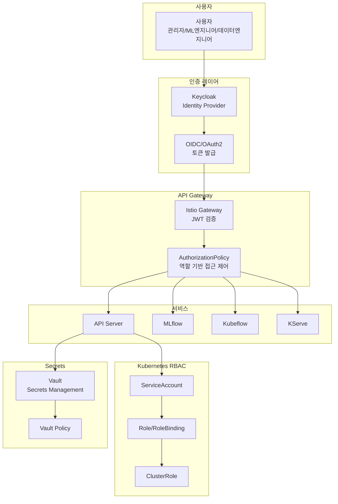
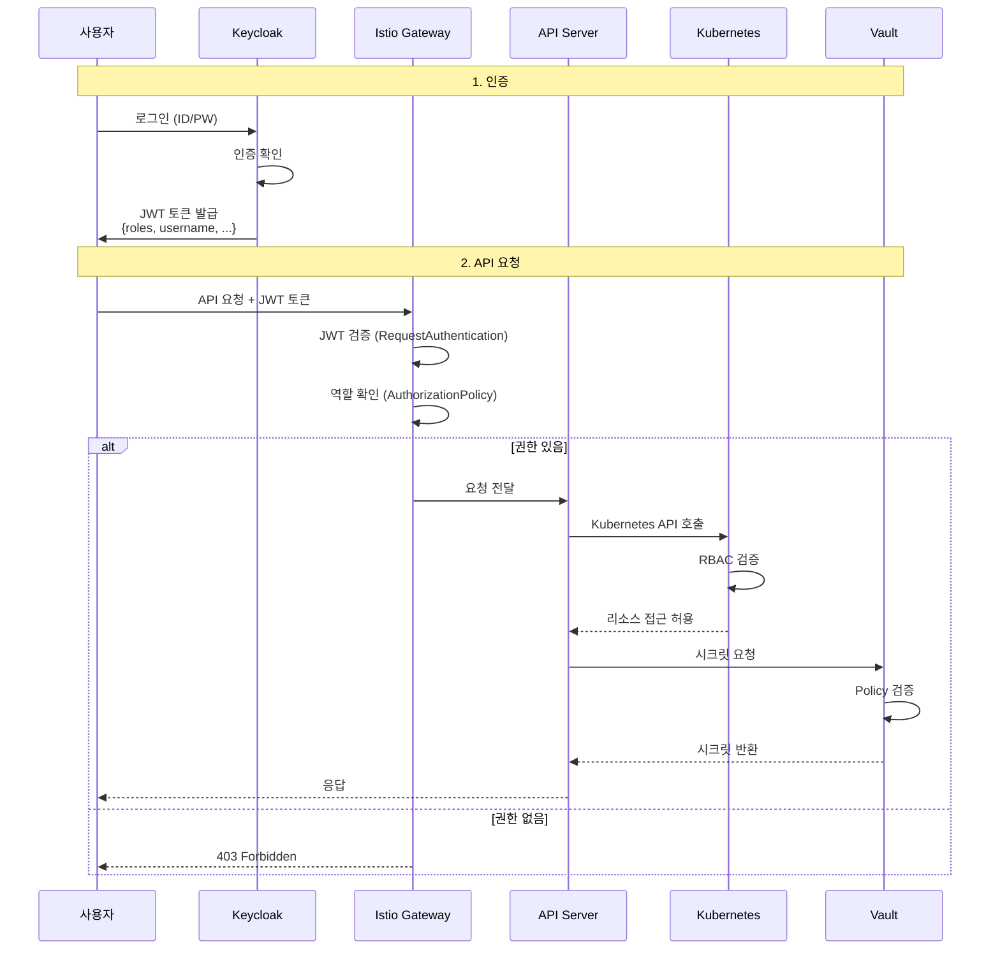

# 인증 및 인가 시스템

## 개요

여러 역할(관리자, ML 엔지니어, 데이터 엔지니어 등)을 관리하고, 각 역할에 따라 접근 권한을 제한하는 통합 인증/인가 시스템입니다.

## 역할 정의

| 역할 | 설명 | 주요 권한 |
|------|------|----------|
| **관리자 (Admin)** | 플랫폼 전체 관리 | 모든 리소스 접근, 사용자 관리, 정책 설정 |
| **ML 엔지니어 (ML Engineer)** | 모델 개발 및 학습 | 개발 환경 생성, 실험 실행, 모델 등록 |
| **데이터 엔지니어 (Data Engineer)** | 데이터 관리 | 데이터 업로드, 데이터 버전 관리, 데이터 품질 관리 |
| **MLOps 엔지니어 (MLOps Engineer)** | 파이프라인 및 배포 관리 | 파이프라인 관리, 모델 배포, 모니터링 |
| **라벨러 (Labeler)** | 데이터 라벨링 | 라벨링 도구 접근, 데이터 라벨링 |
| **뷰어 (Viewer)** | 읽기 전용 접근 | 실험 결과 조회, 모델 정보 조회 |

## 인증/인가 아키텍처



## 권한 매트릭스

| 리소스/액션 | 관리자 | ML 엔지니어 | 데이터 엔지니어 | MLOps 엔지니어 | 라벨러 | 뷰어 |
|------------|--------|------------|---------------|---------------|--------|------|
| **개발 환경** |
| 생성/삭제 | ✅ | ✅ | ❌ | ✅ | ❌ | ❌ |
| 조회 | ✅ | ✅ (본인) | ❌ | ✅ | ❌ | ❌ |
| **실험 관리** |
| 실험 실행 | ✅ | ✅ | ❌ | ✅ | ❌ | ❌ |
| 실험 조회 | ✅ | ✅ (본인) | ❌ | ✅ | ❌ | ✅ |
| 실험 삭제 | ✅ | ✅ (본인) | ❌ | ✅ | ❌ | ❌ |
| **모델 레지스트리** |
| 모델 등록 | ✅ | ✅ | ❌ | ✅ | ❌ | ❌ |
| 모델 승인 | ✅ | ❌ | ❌ | ✅ | ❌ | ❌ |
| 모델 조회 | ✅ | ✅ | ❌ | ✅ | ❌ | ✅ |
| **파이프라인** |
| 파이프라인 생성 | ✅ | ❌ | ❌ | ✅ | ❌ | ❌ |
| 파이프라인 실행 | ✅ | ❌ | ❌ | ✅ | ❌ | ❌ |
| 파이프라인 조회 | ✅ | ❌ | ❌ | ✅ | ❌ | ✅ |
| **모델 배포** |
| 배포 | ✅ | ❌ | ❌ | ✅ | ❌ | ❌ |
| 롤백 | ✅ | ❌ | ❌ | ✅ | ❌ | ❌ |
| 조회 | ✅ | ❌ | ❌ | ✅ | ❌ | ✅ |
| **데이터 관리** |
| 데이터 업로드 | ✅ | ❌ | ✅ | ❌ | ❌ | ❌ |
| 데이터 버전 관리 | ✅ | ❌ | ✅ | ❌ | ❌ | ❌ |
| 데이터 조회 | ✅ | ✅ | ✅ | ✅ | ✅ | ✅ |
| **라벨링** |
| 라벨링 | ✅ | ❌ | ❌ | ❌ | ✅ | ❌ |
| 라벨링 조회 | ✅ | ✅ | ✅ | ✅ | ✅ | ✅ |
| **사용자 관리** |
| 사용자 생성/삭제 | ✅ | ❌ | ❌ | ❌ | ❌ | ❌ |
| 역할 할당 | ✅ | ❌ | ❌ | ❌ | ❌ | ❌ |
| **시크릿 접근** |
| 시크릿 읽기 | ✅ | ✅ (제한적) | ✅ (제한적) | ✅ (제한적) | ❌ | ❌ |
| 시크릿 쓰기 | ✅ | ❌ | ❌ | ❌ | ❌ | ❌ |

## Keycloak 구성

### Realm 및 클라이언트 설정

```yaml
# Keycloak Realm 설정
realm: mlops-platform
clients:
  - clientId: mlops-api
    protocol: openid-connect
    publicClient: false
    standardFlowEnabled: true
    serviceAccountsEnabled: true
    authorizationServicesEnabled: true
    redirectUris:
      - "https://api.mlops.example.com/*"
    roles:
      - name: admin
      - name: ml-engineer
      - name: data-engineer
      - name: mlops-engineer
      - name: labeler
      - name: viewer
```

### 역할 매핑

```yaml
# 사용자 역할 할당 예시
users:
  - username: admin-user
    roles:
      - admin
  - username: ml-engineer-1
    roles:
      - ml-engineer
  - username: data-engineer-1
    roles:
      - data-engineer
```

## Istio 인증 및 인가

### JWT 인증 설정

```yaml
# RequestAuthentication - JWT 검증
apiVersion: security.istio.io/v1beta1
kind: RequestAuthentication
metadata:
  name: jwt-auth
  namespace: mlops-platform
spec:
  selector:
    matchLabels:
      app: mlops-api
  jwtRules:
  - issuer: "https://keycloak.example.com/realms/mlops-platform"
    jwksUri: "https://keycloak.example.com/realms/mlops-platform/protocol/openid-connect/certs"
    forwardOriginalToken: true
```

### 역할 기반 접근 제어

```yaml
# AuthorizationPolicy - ML 엔지니어 권한
apiVersion: security.istio.io/v1beta1
kind: AuthorizationPolicy
metadata:
  name: ml-engineer-policy
  namespace: mlops-dev
spec:
  selector:
    matchLabels:
      app: dev-environment
  action: ALLOW
  rules:
  # ML 엔지니어는 본인의 개발 환경만 접근
  - from:
    - source:
        requestPrincipals: ["*"]
    when:
    - key: request.auth.claims[groups]
      values: ["ml-engineer"]
    - key: request.auth.claims[preferred_username]
      values: ["${USERNAME}"]  # 본인만 접근
---
# AuthorizationPolicy - 데이터 엔지니어 권한
apiVersion: security.istio.io/v1beta1
kind: AuthorizationPolicy
metadata:
  name: data-engineer-policy
  namespace: mlops-platform
spec:
  selector:
    matchLabels:
      app: minio
  action: ALLOW
  rules:
  - from:
    - source:
        requestPrincipals: ["*"]
    when:
    - key: request.auth.claims[groups]
      values: ["data-engineer", "admin"]
    to:
    - operation:
        methods: ["GET", "PUT", "POST"]
        paths: ["/data/*"]
---
# AuthorizationPolicy - 관리자 권한
apiVersion: security.istio.io/v1beta1
kind: AuthorizationPolicy
metadata:
  name: admin-policy
  namespace: mlops-platform
spec:
  selector:
    matchLabels:
      app: mlops-api
  action: ALLOW
  rules:
  - from:
    - source:
        requestPrincipals: ["*"]
    when:
    - key: request.auth.claims[groups]
      values: ["admin"]
    to:
    - operation:
        methods: ["*"]
        paths: ["*"]
```

## Kubernetes RBAC 통합

### ServiceAccount 및 Role 생성

```yaml
# ML 엔지니어용 ServiceAccount
apiVersion: v1
kind: ServiceAccount
metadata:
  name: ml-engineer-sa
  namespace: mlops-dev
  annotations:
    keycloak.org/realm: mlops-platform
    keycloak.org/role: ml-engineer
---
# ML 엔지니어용 Role
apiVersion: rbac.authorization.k8s.io/v1
kind: Role
metadata:
  name: ml-engineer-role
  namespace: mlops-dev
rules:
# 본인의 Pod만 관리
- apiGroups: [""]
  resources: ["pods", "services", "pvc"]
  resourceNames: ["dev-env-*"]  # 본인 이름 패턴
  verbs: ["get", "list", "watch", "create", "update", "patch", "delete"]
- apiGroups: [""]
  resources: ["pods/exec", "pods/log"]
  resourceNames: ["dev-env-*"]
  verbs: ["create"]
---
# RoleBinding
apiVersion: rbac.authorization.k8s.io/v1
kind: RoleBinding
metadata:
  name: ml-engineer-rolebinding
  namespace: mlops-dev
subjects:
- kind: ServiceAccount
  name: ml-engineer-sa
  namespace: mlops-dev
roleRef:
  kind: Role
  name: ml-engineer-role
  apiGroup: rbac.authorization.k8s.io
---
# 데이터 엔지니어용 Role
apiVersion: rbac.authorization.k8s.io/v1
kind: Role
metadata:
  name: data-engineer-role
  namespace: mlops-platform
rules:
- apiGroups: [""]
  resources: ["pods", "jobs"]
  verbs: ["get", "list", "watch"]
- apiGroups: [""]
  resources: ["pvc"]
  verbs: ["get", "list", "watch", "create"]
---
# MLOps 엔지니어용 ClusterRole
apiVersion: rbac.authorization.k8s.io/v1
kind: ClusterRole
metadata:
  name: mlops-engineer-clusterrole
rules:
- apiGroups: [""]
  resources: ["pods", "services", "jobs"]
  verbs: ["get", "list", "watch", "create", "update", "patch", "delete"]
- apiGroups: ["apps"]
  resources: ["deployments"]
  verbs: ["get", "list", "watch", "create", "update", "patch", "delete"]
- apiGroups: ["serving.kserve.io"]
  resources: ["inferenceservices"]
  verbs: ["get", "list", "watch", "create", "update", "patch", "delete"]
- apiGroups: ["kubeflow.org"]
  resources: ["pipelines", "pipelineruns"]
  verbs: ["get", "list", "watch", "create", "update", "patch", "delete"]
```

## Vault 정책 통합

### Vault Policy 정의

```hcl
# 관리자 정책
path "secret/*" {
  capabilities = ["create", "read", "update", "delete", "list"]
}

# ML 엔지니어 정책
path "secret/data/mlflow/*" {
  capabilities = ["read"]
}

path "secret/data/dev-env/*" {
  capabilities = ["read", "update"]
}

# 데이터 엔지니어 정책
path "secret/data/minio/*" {
  capabilities = ["read"]
}

path "secret/data/datasets/*" {
  capabilities = ["read", "create", "update"]
}

# MLOps 엔지니어 정책
path "secret/data/mlflow/*" {
  capabilities = ["read", "update"]
}

path "secret/data/kserve/*" {
  capabilities = ["read", "create", "update"]
}
```

### Vault Kubernetes 인증

```yaml
# Vault Kubernetes Auth 설정
apiVersion: v1
kind: ServiceAccount
metadata:
  name: vault-auth
  namespace: mlops-platform
---
# Vault에서 Kubernetes 역할 생성
# vault write auth/kubernetes/role/ml-engineer \
#   bound_service_account_names=ml-engineer-sa \
#   bound_service_account_namespaces=mlops-dev \
#   policies=ml-engineer-policy \
#   ttl=1h
```

## API 서버 인증/인가 구현

### JWT 토큰 검증

```python
# API 서버에서 JWT 검증 예시
from fastapi import Depends, HTTPException, status
from fastapi.security import HTTPBearer, HTTPAuthorizationCredentials
import jwt
from jwt import PyJWKClient

security = HTTPBearer()

def verify_token(credentials: HTTPAuthorizationCredentials = Depends(security)):
    """JWT 토큰 검증"""
    token = credentials.credentials
    
    # Keycloak에서 공개키 가져오기
    jwks_client = PyJWKClient("https://keycloak.example.com/realms/mlops-platform/protocol/openid-connect/certs")
    signing_key = jwks_client.get_signing_key_from_jwt(token)
    
    try:
        payload = jwt.decode(
            token,
            signing_key.key,
            algorithms=["RS256"],
            audience="mlops-api",
            issuer="https://keycloak.example.com/realms/mlops-platform"
        )
        return payload
    except jwt.ExpiredSignatureError:
        raise HTTPException(status_code=401, detail="Token expired")
    except jwt.InvalidTokenError:
        raise HTTPException(status_code=401, detail="Invalid token")

def require_role(required_role: str):
    """특정 역할 요구 데코레이터"""
    def role_checker(payload: dict = Depends(verify_token)):
        roles = payload.get("realm_access", {}).get("roles", [])
        if required_role not in roles and "admin" not in roles:
            raise HTTPException(
                status_code=403,
                detail=f"Requires role: {required_role}"
            )
        return payload
    return role_checker

# 사용 예시
@app.post("/api/v1/environments")
async def create_environment(
    request: CreateEnvironmentRequest,
    user: dict = Depends(require_role("ml-engineer"))
):
    # ML 엔지니어만 개발 환경 생성 가능
    username = user.get("preferred_username")
    # 환경 생성 로직
    ...
```

## 통합 인증 흐름



## 구현 계획

### Phase 1: Keycloak 설정
1. Keycloak 설치 및 구성
2. Realm 및 클라이언트 생성
3. 역할 정의 및 사용자 할당

### Phase 2: Istio 통합
1. RequestAuthentication 설정
2. AuthorizationPolicy 정의
3. JWT 검증 테스트

### Phase 3: Kubernetes RBAC
1. ServiceAccount 생성
2. Role/RoleBinding 정의
3. ClusterRole 정의 (필요 시)

### Phase 4: Vault 통합
1. Vault Policy 정의
2. Kubernetes 인증 설정
3. 시크릿 접근 테스트

### Phase 5: API 서버 통합
1. JWT 검증 미들웨어 구현
2. 역할 기반 엔드포인트 보호
3. 통합 테스트

## 참고 자료

- [Keycloak Documentation](https://www.keycloak.org/documentation)
- [Istio Authentication](https://istio.io/latest/docs/tasks/security/authentication/)
- [Istio Authorization](https://istio.io/latest/docs/tasks/security/authorization/)
- [Kubernetes RBAC](https://kubernetes.io/docs/reference/access-authn-authz/rbac/)
- [Vault Kubernetes Auth](https://www.vaultproject.io/docs/auth/kubernetes)

